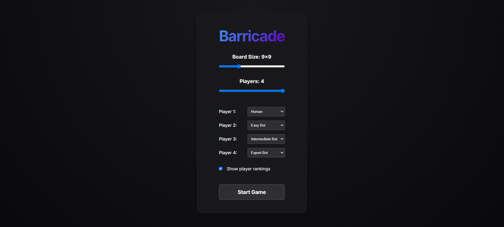
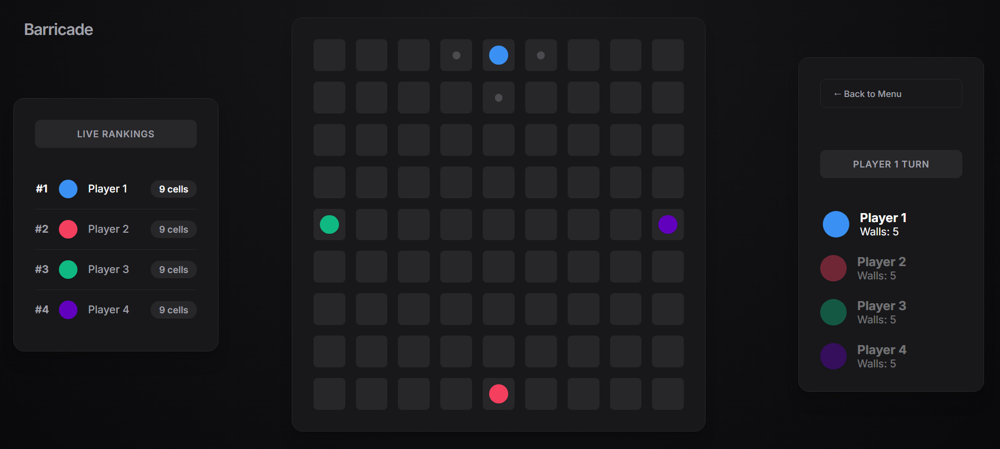
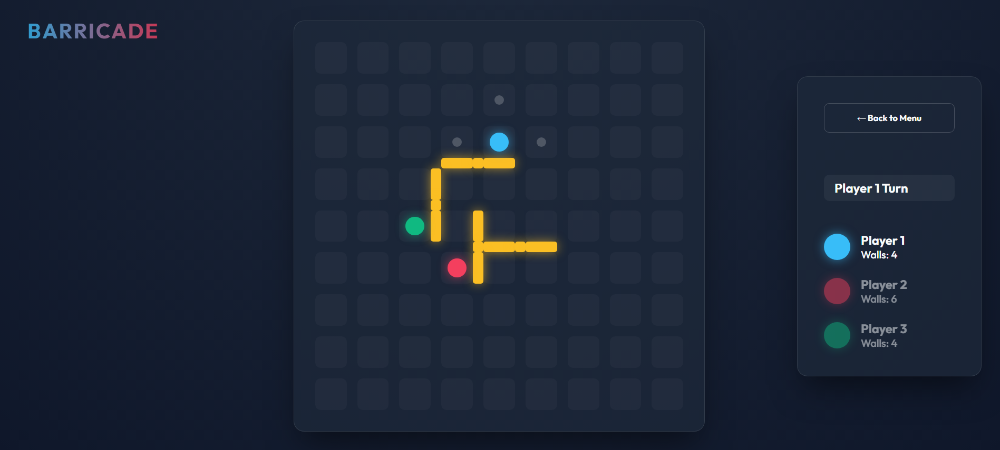
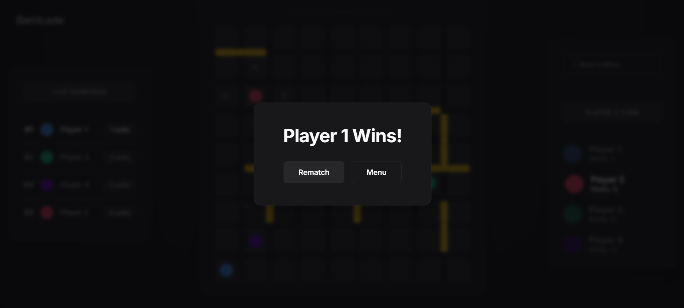

# Barricade

**Barricade** est un jeu de plateau stratégique inspiré de **Quoridor**, développé en **TypeScript avec React**.

Le principe est simple : déplacez votre pion jusqu'à la ligne opposée avant vos adversaires, tout en plaçant des barrières pour ralentir leur progression. Le jeu permet de jouer localement contre d'autres joueurs ou contre des IA avec 3 niveaux de difficulté.

## Captures d'écran

### Menu principal et configuration d'une partie



### Plateau de jeu



### Placement de barrières



### Fin de partie



## Architecture technique & gestion du jeu

Le projet est organisé autour d'une séparation entre la logique du jeu, les modèles de données et l'interface React.

- **Logique du plateau (`Board`)** :
  - Création de la grille de jeu.
  - Gestion des joueurs.
  - Gestion des tours.
  - Validation des déplacements.
  - Placement et validation des barrières.
  - Détection de la victoire.
  - Notification de l'interface lors des changements d'état.

- **Modèles de données** :
  - Représentation des cellules du plateau.
  - Représentation des joueurs.
  - Définition des objectifs.
  - Représentation des barrières horizontales et verticales.
  - Gestion des niveaux de difficulté des bots.

- **Recherche de chemins (`Pathfinder`)** :
  - Implémentation d'un algorithme de **Parcours en largeur (Breadth-First Search - BFS)**.
  - Explore les cases voisines de proche en proche à l'aide d'une file (queue), garantissant de trouver le chemin le plus court vers l'objectif.
  - L'ordre d'exploration des directions (Haut, Bas, Gauche, Droite) est mélangé aléatoirement pour éviter des déplacements répétitifs et robotiques de la part de l'IA.
  - Ce module est crucial à la fois pour guider les bots et pour vérifier qu'un mur placé ne bloque pas totalement un joueur.

- **Intelligence artificielle (`AI`)** :
  - **Bot Facile :** Ne pose jamais de mur et se contente d'avancer vers son objectif en suivant le chemin le plus court fourni par le Pathfinder.
  - **Bot Intermédiaire :** Analyse les chemins de ses adversaires. Si un adversaire est plus proche de la victoire que lui, le bot a 85% de chance de tenter de placer un mur sur les prochains pas de cet adversaire pour le ralentir. S'il ne trouve pas de mur pertinent ou qu'il est en tête, il se contente d'avancer.
  - **Bot Expert :** Calcule à chaque tour tous les déplacements valides et plusieurs placements de murs potentiels. Il attribue un score à chaque action en calculant un ratio mathématique entre son avancée et le retardement des adversaires, puis exécute l'action qui maximise ses chances de victoire.

- **Interface React** :
  - Menu de configuration.
  - Plateau de jeu interactif.
  - Affichage des pions.
  - Indication des déplacements valides.
  - Prévisualisation des barrières.
  - Informations sur les joueurs.
  - Fenêtre de fin de partie.

- **Réactivité de l'interface** :

  Le plateau publie les changements d'état afin que React puisse actualiser automatiquement l'affichage après chaque action valide.

## Technologies utilisées

- **Langage :** TypeScript
- **Interface utilisateur :** React 19
- **Outil de développement et de compilation :** Vite
- **Rendu :** HTML, CSS et composants React
- **Gestion des dépendances :** npm
- **Environnement :** Node.js
- **Déploiement :** Application web statique compatible avec GitHub Pages

## Règles du jeu

Barricade reprend les principes fondamentaux d'un jeu de course tactique sur grille.

1. Chaque joueur commence sur un bord différent du plateau.
2. L'objectif est d'atteindre le bord opposé à sa position de départ.
3. À son tour, un joueur peut déplacer son pion ou placer une barrière.
4. Un déplacement classique consiste à se déplacer vers une cellule adjacente libre.
5. Lorsqu'un adversaire occupe une cellule adjacente, le joueur peut sauter par-dessus lui si la cellule suivante est disponible.
6. Une barrière peut bloquer plusieurs passages, mais elle ne peut jamais supprimer tous les chemins possibles vers l'objectif d'un joueur.
7. Le premier joueur qui atteint sa ligne d'arrivée remporte la partie.

## Configuration d'une partie

Le menu principal permet de configurer différents paramètres avant de commencer une partie.

### Taille du plateau

La taille du plateau peut être réglée avec un curseur.

Les dimensions disponibles vont de **5×5 à 19×19**, avec uniquement des tailles impaires :

- 5×5
- 7×7
- 9×9
- 11×11
- 13×13
- 15×15
- 17×17
- 19×19

### Nombre de joueurs

Une partie peut accueillir entre **2 et 4 joueurs**.

Chaque joueur commence depuis un côté différent du plateau et possède une ligne d'arrivée correspondante.

### Type de joueur

Chaque participant peut être configuré comme :

- Joueur humain.
- Bot facile.
- Bot intermédiaire.
- Bot expert.

Il est donc possible de jouer :

- contre d'autres joueurs humains ;
- contre un ou plusieurs bots ;
- avec une combinaison de joueurs humains et de bots ;
- avec plusieurs bots de niveaux différents.

## Déplacements des joueurs

À chaque tour, le joueur actif peut sélectionner une cellule valide directement sur le plateau.

Les cellules accessibles sont indiquées visuellement afin de faciliter la navigation.

Un joueur peut se déplacer :

- vers le haut ;
- vers le bas ;
- vers la gauche ;
- vers la droite.

Les déplacements sont automatiquement bloqués lorsqu'une barrière empêche le passage.

### Saut par-dessus un adversaire

Lorsqu'un adversaire se trouve sur une cellule voisine, le joueur peut sauter par-dessus lui si la cellule située derrière est disponible.

Le saut est refusé lorsque :

- la cellule d'atterrissage est en dehors du plateau ;
- une autre barrière bloque le passage ;
- un autre joueur occupe déjà la cellule d'atterrissage.

## Barrières

Les barrières permettent de ralentir les adversaires en bloquant certains passages du plateau.

Elles peuvent être placées :

- horizontalement ;
- verticalement.

Le placement s'effectue en cliquant sur les espaces situés entre les cellules.

### Prévisualisation

Lors du déplacement de la souris sur un espace de placement, le jeu affiche une prévisualisation de la barrière lorsque le placement est valide.

Cette prévisualisation permet de vérifier rapidement :

- l'orientation de la barrière ;
- sa position ;
- sa validité ;
- son impact potentiel sur le plateau.

### Conditions de placement

Une barrière ne peut pas être placée si :

- elle est située en dehors du plateau ;
- elle chevauche une autre barrière ;
- elle croise une autre barrière ;
- elle utilise une position déjà occupée ;
- le joueur ne possède plus de barrières ;
- elle bloque complètement le chemin d'un joueur vers son objectif.

Le jeu simule le placement avant de le valider afin de garantir que chaque participant conserve toujours au moins un chemin possible vers sa ligne d'arrivée.

### Barrières restantes

Chaque joueur possède un nombre limité de barrières. Ce nombre est défini au début de la partie selon la taille du plateau et le nombre de joueurs :

**Nombre de barrières par joueur = ⌊round(nombre de cellules totales ÷ 4) ÷ nombre de joueurs⌋**

Par exemple, pour un plateau de **9×9** avec **3 joueurs** :  
**⌊round(81 ÷ 4) ÷ 3⌋ = ⌊20 ÷ 3⌋ = 6 barrières par joueur.**

Le nombre de barrières restantes est affiché dans le panneau latéral pendant toute la partie.

## Installation et exécution

### Prérequis

Assurez-vous d'avoir installé :

- **Node.js** ;
- **npm**.

### Installation

1. **Cloner le dépôt :**

    ```bash
    git clone https://github.com/D-l-E-G-O/Barricade.git
    cd Barricade
    ```

2. **Installer les dépendances :**

    ```bash
    npm install
    ```

3. **Lancer le serveur de développement :**

    ```bash
    npm run dev
    ```

    Vite indiquera l'adresse locale à ouvrir dans votre navigateur.

### Construction de la version de production

Pour compiler l'application :

```bash
npm run build
```

Cette commande :

- vérifie le typage TypeScript ;
- compile l'application React ;
- génère les fichiers optimisés pour la production.

### Prévisualisation de la version de production

Pour lancer localement la version compilée :

```bash
npm run preview
```

## Commandes disponibles

| Commande          | Description                                      |
| :---------------- | :----------------------------------------------- |
| `npm install`     | Installe les dépendances du projet               |
| `npm run dev`     | Lance le serveur de développement Vite           |
| `npm run build`   | Vérifie TypeScript et construit l'application    |
| `npm run preview` | Sert localement la version de production         |

## Déploiement

L'application est accessible à l'adresse suivante : https://d-l-e-g-o.github.io/Barricade/
